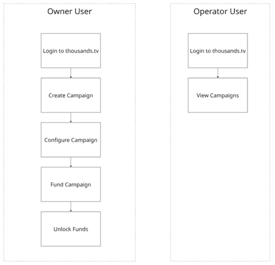
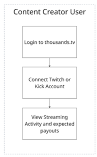
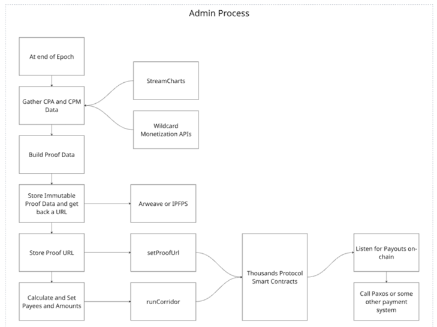
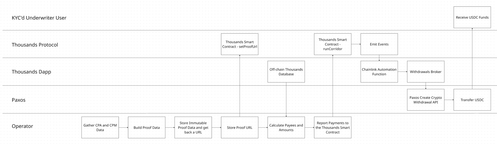
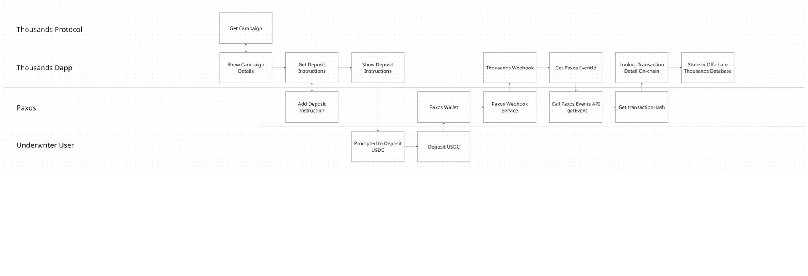

# **Thousands Network**

**Status: This project is unfinished. Thousands Foundation and may not have been fully implemented as described in this document. This repository is being made available as open-source software under the MIT License so that the work may benefit the broader developer community. Nothing in this repository constitutes an offer, solicitation, or invitation, in relation to any token or protocol, nor any representation or warranty that any code in the repository is functional.**

***

## **Overview**

Thousands Network was conceived as the attribution layer of the internet — a blockchain-enabled protocol designed for brands whose businesses benefit from word-of-mouth support.  The initial intended business sector was online gaming, however the protocol can apply across business sectors that benefit from word of mouth consumer support.  The protocol was intended to make word-of-mouth value visible, verifiable, and fairly compensated for the first time.

Word-of-mouth accounts for an estimated $6 trillion in annual consumer spending, yet, in online gaming, the creators, streamers, community organizers, and everyday advocates who drive that spending capture almost none of it. Only the top 1% of creators ever secure brand sponsorship deals. The other 99% generate genuine commercial value — sometimes at conversion rates that outperform major influencers — but have no mechanism to prove their impact or receive payment for it.  Thousands was built to fix that. 

As you explore the codebase in this repository, you will see that the early stage implementation was intended for a specific brand, Wildcard, a multiplayer arena-based videogame that launched on Steam and ran a live, tournament-style game series to promote the product to new users.  This approach to the launch was underpinned by early Thousands features.

***

## **The Problem**

Traditional digital marketing attribution is opaque, trust-dependent, and structurally biased toward scale. Brands chase celebrity influencers while the authentic voices that actually drive the majority of their sales go unrecognized and uncompensated. Web2 platforms extract value from creator communities while returning little to the individuals who power them.

This creates a compounding inequity: the more a creator's audience trusts them, the more commercial value they generate — but without attribution infrastructure, that value flows to intermediaries rather than to the creators themselves.

***

## **The Vision**

Thousands proposed a fundamental reorientation: bring conversion funnels on-chain, make attribution cryptographically verifiable, and automate value distribution directly to everyone who contributes to a successful outcome.

The protocol was designed to serve four constituencies simultaneously:

- **Brands and IP owners** would gain access to the full spectrum of creator-driven distribution — not just top-tier influencers — with attribution they could verify rather than trust.

- **Operators** (advertising agencies, talent managers, community administrators) would gain an open marketplace to coordinate campaigns at any scale without acting as gatekeepers.

- **Creators of any size** — from streamers with fifty loyal viewers to large community Discord servers — would gain the ability to prove their impact and be paid for it, instantly and automatically.

- **Token holders and delegators** would participate in network governance and earn yield derived from real campaign revenue rather than inflationary incentives.

***

## **How It Was Designed to Work**

### **The Campaign Primitive**

The core building block of the Thousands Protocol was the **Campaign** — a smart contract structure that turns digital conversions into programmable, transparent, on-chain events. Analogous to how Uniswap made token exchange permissionless, the Campaign primitive was intended to make digital engagement instantly attributable without negotiation, minimums, or gatekeepers.

Each Campaign smart contract supported:

- **Escrowed budgets** — brands fund campaigns in USDC or any ERC-20 token, held in escrow until verified conversions occur

- **Unified attribution logic** — a single consistent model covering both CPA (cost-per-action) and CPM (cost-per-impression) campaign types

- **Capacity throttling** — Creator Agencies earn campaign capacity based on performance and $THOU token staking, creating a quality signal baked into the protocol itself

- **Universal compatibility** — designed to accept conversions originating from any platform (social networks, streaming services, community servers, websites, mobile apps, games) and any conversion event type (purchases, subscriptions, signups, installs)

### **Corridors**

Within each Campaign, distribution logic was handled by **Corridors** — modular, composable building blocks that defined exactly how value would flow once a conversion was verified. Corridors enabled:

- Customized revenue splits among multiple stakeholders

- Vesting schedules to incentivize long-term alignment

- Bonus multipliers for high-impact results or specific user behaviors

- Cross-chain transaction support

### **Cryptographic Attribution via zk-TLS**

A central technical ambition of the protocol was replacing trust-based attribution with mathematical proof. Thousands intended to leverage **Zero Knowledge Transport Layer Security (zk-TLS)** to generate cryptographic proof of platform metrics, making false or inflated conversion claims economically irrational rather than merely contractually prohibited.

### **Campaign Execution Flow**

The intended end-to-end flow of a campaign was:

1. A brand funds a Campaign smart contract with their preferred ERC-20 token

2. Operators stake $THOU tokens, signaling reliability and establishing their capacity within the network

3. Operators engage Creators to produce authentic content driving measurable audience actions

4. Users convert based on creator recommendations

5. The Thousands Protocol cryptographically verifies each conversion event

6. Payments are automatically and instantly disbursed to all participants according to pre-defined Corridor logic — no invoicing, no waiting, no intermediary approval

***

## **The $THOU Token** 

## **\[NOTE: The $THOU token was minted but never launched or publicly traded on an exchange. All $THOU held by the Thousands Foundation will be sent to a null address and, effectively, burned when Thousands Foundation is liquidated.]**

The **$THOU token** was designed as the economic backbone of the protocol — not a speculative asset, but a functional instrument with three primary roles:

- **Staking by Operators (Creator Agencies)** to establish campaign capacity and signal trustworthiness. The amount staked directly would determine the volume of traffic and conversions an Operator could handle.

- **Delegation by token holders** to Operators, earning a proportional share of Operator performance fees denominated in USDC — yield derived from real network activity, not token inflation.

- **Governance participation** — staked and delegated $THOU would carry voting rights, aligning governance influence with demonstrated network contribution.

The value accrual model was designed as a self-reinforcing cycle: campaign activity generates fees, fees fund ecosystem expansion and token buybacks, increased token demand drives greater staking, and greater staking expands network capacity and quality — drawing more campaigns and beginning the cycle again.

***

## **Protocol Stakeholders**

|                                  |                                                                                           |
| -------------------------------- | ----------------------------------------------------------------------------------------- |
| **Stakeholder**                  | **Role**                                                                                  |
| **Thousands Network**            | Maintains protocol infrastructure, governs key parameters, manages treasury               |
| **Brands**                       | Fund campaigns with any ERC-20 token, define desired conversion outcomes                  |
| **Operators (Creator Agencies)** | Manage campaigns, work directly with creators, stake $THOU to establish capacity          |
| **Creators**                     | Engage audiences through authentic content, earn instant payment upon verified conversion |
| **Delegators**                   | Stake $THOU to Operators, earn yield from Operator performance fees                       |

***

## **Governance: The Thousands DAO**

The protocol was designed to be community-governed through a **Decentralized Autonomous Organization (DAO)** with several structural innovations intended to prevent concentration of control:

- **Community veto power** — token holders could veto any DAO Council proposal within a 7-day window, preserving community oversight regardless of Council composition

- **Performance-based governance influence** — Creator Agencies earned delegated voting power from token holders, meaning governance weight tracked demonstrated network contribution rather than token holdings alone

- **Elected Community Voice** — a democratically elected representative sat on the DAO Council with an explicit mandate to surface community interests in strategic decisions

- **Working Groups** — small, expert-led teams accountable to the Council and community, formed around specific strategic initiatives

***

## **What Was Built**

|                                                                                                                                                                                                                                                                                                                                                                                                                                                                   |
| ----------------------------------------------------------------------------------------------------------------------------------------------------------------------------------------------------------------------------------------------------------------------------------------------------------------------------------------------------------------------------------------------------------------------------------------------------------------- |
| The following source code is from a specific snapshot in time and does not represent the production code that was running on thousands.tv or Thousands Services.  The source code provided here includes many prototypes that were never deployed publicly as well as modifications to production code that were never deployed.  The source code has also been modified to remove any secrets or code Thousands Foundation doesn’t have a license to distribute. |

The Thousands repository consists of three codebases: thousands.tv, thousands-services, thousands-smart-contracts.

## thousands.tv

This codebase includes two NextJS applications.  The Dapp and the NodeJS-Bot.

### Dapp (wildcard/apps/dapp)

The Dapp contains the NextJS frontend that was deployed at thousands.tv using Vercel and includes the following features.

#### Thousands.tv Streaming Application

The streaming application is a Twitch style streaming app that was used to broadcast Thousands livestream events.  It uses Amazon IVS as the backend streaming technology.  For chat and other push notifications, it uses PubNub.  Some of the code that allows navigation to the Streaming Application may be commented out, but starting at wildcard/apps/dapp/pages/\[serverCode]/stream/\[streamId] will show how the streaming works.  The streaming application allowed various chat applications to be deployed.  These chat applications ran within the Thousands.tv chat and allowed users to interact with them during the livestream.  See the list of chat applications below in the thousands-services section.

#### Wildcard Franchises

The Wildcard Franchise game allows users to start Wildcard franchises, manage and upgrade those franchises, and displays a franchise leaderboard.  Franchises are upgraded by acquiring NFT’s via a Snag Solutions integration.

#### Wildcard Rally Predictions

The Wildcard Rally Predictions game allows users to make predictions of future Wildcard game activity.  Charts display data feeds from the Wildcard Game and are updated nightly.  The game data comes from a proprietary MongoDB database on Beamable.  That schema is not included in this source code.

#### Thousands User Account Management

Thousands.tv contains a set of pages for managing user accounts.  This includes managing connected external logins (Twitch, Discord, X, Kick, etc.) and wallets as well as customizing your appearance on [Thousands.tv](http://thousands.tv).

#### Thousands Competitor Portal

The competitor portal allows users to login, view their rewards, and configure payout methods.  Payouts are made via USDC or a Stripe integration.

#### Thousands Creator Portal

The Creator Portal allows users to login, connect their external streaming accounts, and track rewards for streaming.

**Dependency Injection**

The Dapp is using the repositories and services pattern and dependencies are injected using Inversify.  The list of injected dependencies can be managed in wildcard/apps/dapp/inversify.config.ts.

### NodeJS-Bot (wildcard/apps/nodejs-bot)

The NodeJS-Bot has a transaction queue to manage and process blockchain transactions.

**Turbo Monorepo**

The thousands-tv repository is using Turbo to create a monorepo.  This monorepo shares packages between the dapp and the nodejs-bot.  These packages are in wildcard/packages and are divided into interfaces, schemas, and utils.

## thousands-services

Many of the backend services that power thousands.tv were deployed as Amazon Lambda functions.  These functions are contained in this codebase.  Some of these functions are prototypes that were never deployed and may not be complete.  The backend services primarily interact with the Thousands MongoDB database, the Thousands Redis Server, and other external API's.  These C# .NET 8 functions were deployed on AWS Lambda and accessed through an AWS API Gateway (REST).  Each function has a set of environment variables that are required to be set for the function to operate.

Here are some of the features that were powered by these functions:

### Skybox Thousands.tv Chat Application

This chat app was used to allow users to purchase a skybox and invite friends to join.  The following functions help to power this application.

- IvsAcceptRejectSkyboxInvitation

- IvsCustomizeSkybox

- IvsInviteSkyboxMember

- IvsProcessEmojis

- IvsPurchaseSkybox

- IvsRemoveSkyboxMember

### Rally Thousands.tv Chat Application

This chat application allows users to rally their team (Red or Blue), gain points, and move up the leaderboard.

- IvsBoost

- IvsConfirmPrediction

- IvsIdleGameChatAction

- IvsIdleGameCreatorAction

- IvsIdleGameGameEvent

- IvsIdleGamePlayerAction

- IvsInitiatePrediction

- IvsPredictionSetWinner

- IvsRally

### Vote Thousands.tv Chat Application

This chat application allows moderators to pose a vote to the chat that users can interact with to place their votes.  After the vote ends, the votes are tallied, and the final results are displayed.

- IvsVoteGetHistory

- IvsVoteHide

- IvsVotePlace

- IvsVoteStart

### Coin Market Thousands.tv Chat Application (Prototype)

This chat app prototype was never deployed, but it allowed users to create their own meme coins and trade them in chat.

- IvsMarketGetMyCoins

- IvsMarketGetPriceQuote

- IvsMarketGetTopCoins

- IvsMarketPlaceOrder

### Thousands.tv Stream Entry Queue

This feature allows users without a ticket to a livestream to join a queue.  Moderators can then advance that queue to let users into the livestream.

- IvsQueueAdvance

- IvsQueueGetPosition

- IvsQueueJoin

### Wildcard Franchise Application

The Wildcard Franchise game allows users to start Wildcard franchises, manage and upgrade those franchises, and displays a franchise leaderboard.

- IvsPeriodicPredictionUpdates

- RallyPredictionsConfirm

- RallyPredictionsGet

- RallyPredictionInitiate

### Kick Stream Monitoring (Prototype)

Monitor Kick streams to track who is streaming Wildcard and how long they are streaming it for.

- KickListener

- KickPolling

## thousands-smart-contracts

The thousands-smart-contracts folder contains prototype smart contracts that were never deployed on a production blockchain.  Thousands also used off the shelf ERC20 contracts from OpenZeppelin and ERC-1155 from Snag Solutions.

## Thousands Protocol Flowcharts

## Data and External Services

Thousand’s data is stored in a Thousands MongoDB and Thousands Redis Collection.  In addition to those data sources, Thousands also used the following external services:

**Alchemy**

Used to make real-time and scheduled API calls for gathering information from various blockchains.

**Amazon IVS**

The Thousands Streaming feature uses Amazon IVS for video streaming.

**PubNub**

The Thousands Streaming feature uses PubNub for chat message distribution as well as push notifications for Chat Apps.

**Snag Solutions**

Snag Solutions provides an NFT marketplace as well as API’s for referral management.

**Stripe**

Stripe provides identity and payment (outgoing) services.

**ThirdWeb**

ThirdWeb provides services for purchasing Thousands credits with a large variety of crypto tokens.

***

## **Project Status**

Thousands Foundation is in the process of voluntary liquidation. A first version of the product was launched but did not achieve the commercial success required to continue operations. This codebase was released as-is. It is incomplete. There is no active development team, no maintained infrastructure, and no ongoing support.

This software is offered to the open-source community in the hope that the underlying ideas, smart contract architecture, or implementation work may be of value to future builders working on creator attribution, decentralized campaign infrastructure, or Web3 monetization primitives.

***

## **License**

This project is released under the **MIT License**. See `LICENSE` for details.

THE SOFTWARE IS PROVIDED “AS IS”, WITHOUT WARRANTY OF ANY KIND, EXPRESS OR IMPLIED, INCLUDING BUT NOT LIMITED TO THE WARRANTIES OF MERCHANTABILITY, FITNESS FOR A PARTICULAR PURPOSE AND NONINFRINGEMENT. IN NO EVENT SHALL THE AUTHORS OR COPYRIGHT HOLDERS BE LIABLE FOR ANY CLAIM, DAMAGES OR OTHER LIABILITY, WHETHER IN AN ACTION OF CONTRACT, TORT OR OTHERWISE, ARISING FROM, OUT OF OR IN CONNECTION WITH THE SOFTWARE OR THE USE OR OTHER DEALINGS IN THE SOFTWARE.

***

## **Learn More**

The original protocol litepaper is available in this repository as `LITEPAPER.md` and describes the full intended design of the Thousands Network in the team's own words.
